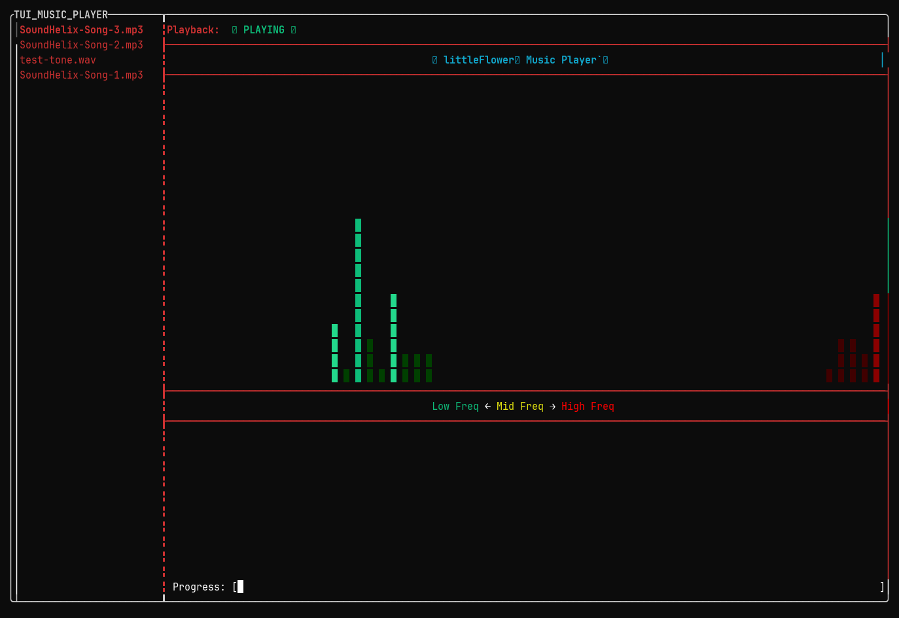

# TUI_MusicPlayer

A terminal music player with a live spectrum visualizer. Point it at a folder
of mp3/wav/flac files and it plays them, with mirrored stereo bars colored
by frequency band.



## Build

You need CMake, a C++17 compiler, and FFTW dev files
(`libfftw3-dev` on Debian/Ubuntu). miniaudio and FTXUI are already in the
repo / fetched by CMake.

```sh
cmake -S . -B build
cmake --build build -j
```

## Run

```sh
./build/test-starter ~/Music/
```

Keep the trailing slash on the folder — path joining is naive at the moment
and it won't find your files without it.

Pick a file with up/down, Enter to play, Space to pause and resume, q to quit.

## How it works

- Playback through miniaudio, one device + decoder at a time
- UI built with FTXUI (playlist on the left, visualizer + progress on the right)
- Spectrum from cavacore (FFTW under the hood), refreshed from the audio
  callback at ~60fps

## Still to do

Click-to-play, next/previous track, seeking, volume control, and moving on
to the next song automatically when one ends.
